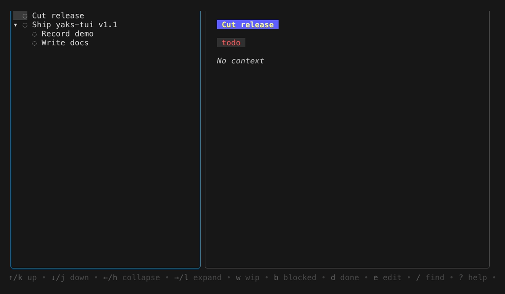

# yaks-tui


An interactive, keyboard-driven terminal UI for [yaks](https://github.com/mattwynne/yaks).

Browse your yak tree in two panes — tree on the left, rendered markdown detail on
the right — and triage state without leaving the keyboard.



## Requirements

- `yx` (yaks) on your PATH
- `fzf` (optional, enables `/` fuzzy jump)
- A repo with `.yaks/` initialized (and `.yaks` gitignored)

Markdown detail is rendered in-process with
[glamour](https://github.com/charmbracelet/glamour) — no `glow` or other external
renderer is required.

## Install

```bash
go install github.com/WhimsicalBees/yaks-tui@latest
```

Or build from source:

```bash
make build
./bin/yaks-tui      # run inside a yaks repo
```

## Keys

| Key | Action |
|-----|--------|
| `↑`/`k`, `↓`/`j` | move cursor |
| `→`/`l`, `←`/`h` | expand / collapse |
| `enter` | toggle fold |
| `tab` | switch pane focus |
| `w` / `b` / `d` / `t` | set state wip / blocked / done / todo |
| `e` | edit context body inline |
| `H` | hide done yaks |
| `W` | focus wip / blocked |
| `f` | search by name |
| `/` | fuzzy jump (needs fzf) |
| `r` | reload |
| `?` | toggle help |
| `q` / `ctrl+c` | quit |

While editing: `ctrl+s` saves, `esc` cancels.

## Documentation

Full docs live in [`docs/`](docs/README.md): a getting-started tutorial,
how-to guides, a keybinding reference, and design explanations.

## License

[MIT](LICENSE) © 2026 Lena Anne Krug

## Scope

v1 is browse + triage. v1.1 adds inline editing of a yak's context body (`e`).
Editing other fields, adding/moving/removing yaks, tags, sync, and configurable
layouts are still planned — see `docs/superpowers/specs/`.
